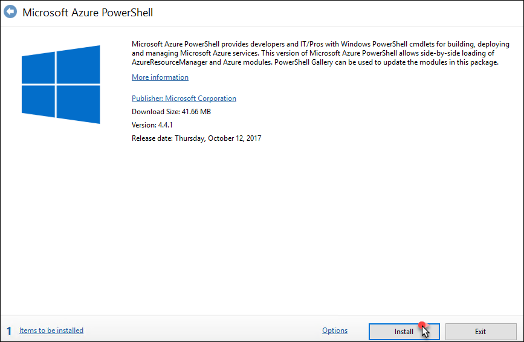
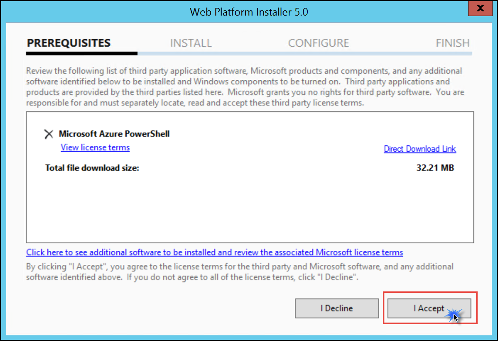
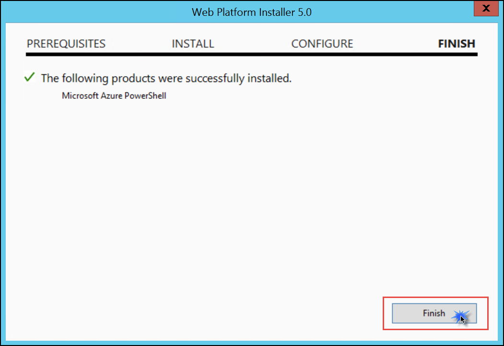

Enterprise-class networking in Azure

Before the hands-on lab setup guide

January 2019

Information in this document, including URL and other Internet Web site references, is subject to change without notice. Unless otherwise noted, the example companies, organizations, products, domain names, e-mail addresses, logos, people, places, and events depicted herein are fictitious, and no association with any real company, organization, product, domain name, e-mail address, logo, person, place or event is intended or should be inferred. Complying with all applicable copyright laws is the responsibility of the user. Without limiting the rights under copyright, no part of this document may be reproduced, stored in or introduced into a retrieval system, or transmitted in any form or by any means (electronic, mechanical, photocopying, recording, or otherwise), or for any purpose, without the express written permission of Microsoft Corporation.

Microsoft may have patents, patent applications, trademarks, copyrights, or other intellectual property rights covering subject matter in this document. Except as expressly provided in any written license agreement from Microsoft, the furnishing of this document does not give you any license to these patents, trademarks, copyrights, or other intellectual property.

The names of manufacturers, products, or URLs are provided for informational purposes only and Microsoft makes no representations and warranties, either expressed, implied, or statutory, regarding these manufacturers or the use of the products with any Microsoft technologies. The inclusion of a manufacturer or product does not imply endorsement of Microsoft of the manufacturer or product. Links may be provided to third party sites. Such sites are not under the control of Microsoft and Microsoft is not responsible for the contents of any linked site or any link contained in a linked site, or any changes or updates to such sites. Microsoft is not responsible for webcasting or any other form of transmission received from any linked site. Microsoft is providing these links to you only as a convenience, and the inclusion of any link does not imply endorsement of Microsoft of the site or the products contained therein.

© 2019 Microsoft Corporation. All rights reserved.

Microsoft and the trademarks listed at <https://www.microsoft.com/en-us/legal/intellectualproperty/Trademarks/Usage/General.aspx> are trademarks of the Microsoft group of companies. All other trademarks are property of their respective owners.

**Contents**

<!-- TOC -->

- [Enterprise-class networking in Azure before the hands-on lab setup guide](#enterprise-class-networking-in-azure-before-the-hands-on-lab-setup-guide)
    - [Requirements](#requirements)
    - [Before the hands-on lab](#before-the-hands-on-lab)
        - [Task 1: Create a virtual machine to execute the lab in](#task-1-create-a-virtual-machine-to-execute-the-lab-in)
        - [Task 2: Update Azure PowerShell version](#task-2-update-azure-powershell-version)
        - [Task 3: Download hands-on lab step-by-step support files](#task-3-download-hands-on-lab-step-by-step-support-files)

<!-- /TOC -->

# Enterprise-class networking in Azure before the hands-on lab setup guide

## Requirements

You must have a working Azure subscription to carry out this hands-on lab step-by-step without a spending cap to deploy the Barracuda firewall from the Azure Marketplace.

## Before the hands-on lab

Duration: 15 minutes

If you are working on a machine that cannot run PowerShell, carry out this task. Only do this if you are not running the commands on your local machine and are provisioning a VM to perform the steps.

### Task 1: Create a virtual machine to execute the lab in

1.  Launch a browser, and navigate to <https://portal.azure.com>. Once prompted, login with your Microsoft Azure credentials. If asked, choose whether your account is an organization account or just a Microsoft Account.

1.  Select **+NEW**, and in the search box, type in **Visual Studio Community 2017 on Windows Server 2016 (x64)**, and press enter. Select the Visual Studio Community 2017 image running on Windows Server 2016 with the latest update.

3.  In the returned search results, select the image name.

    

4.  In the Marketplace solution blade, at the bottom of the page keep the deployment model set to **Resource Manager**, and choose **Create**.

5.  Set the following configuration on the Basics tab, and choose **OK**:

    -   Name: **LABVM**

    -   VM disk type: **SSD**

    -   User name: **demouser**

    -   Password: **demo\@pass123**

    -   Subscription: **If you have multiple subscriptions, choose the subscription to execute your labs in**.

    -   Resource Group: **OPSLABRG**

    -   Location: **Choose the closest Azure region to you**.

6.  Choose the **DS1\_V2 Standard** or **F2S** instance size on the Size blade.

    >**Note**: If the Azure Subscription you are using is **NOT** a trial Azure subscription, you may want to choose the DS2\_V2 to have more power in this LABMV. If you are using a Trial Subscription or one that you know has a restriction on the number of cores, stick with the DS1\_V2.

7.  Select **Configure required settings** to specify a storage account for your virtual machine if a storage account name is not automatically selected for you.

8.  Select **Create New**.
9.  Specify a unique name for the storage account (all lower letters and alphanumeric characters), and ensure the green checkmark shows the name is valid.

10. Select **OK** to continue.

11. Select **Configure required settings** for the Diagnostics storage account if a storage account name is not automatically selected for you. Repeat the previous steps to select a unique storage account name. This storage account will hold diagnostic logs about your virtual machine that you can use for troubleshooting purposes.

12. Accept the remaining default values on the Settings blade, and choose **Review and Create**. The deployment should begin provisioning. It may take 10+ minutes for the virtual machine to complete provisioning.

    >**Note:** Please wait for the LABVM to be provisioned prior to moving to the next step.

13. Move back to the Portal page on your local machine, and wait for **LABVM** to show the Status of **Running**. Choose **Connect** to establish a new Remote Desktop Session.

    

14. Depending on your Remote Desktop protocol client and browser configuration, you will either be prompted to open an RDP file, or you will need to download it and then open it separately to connect.

15. Log in with the credentials specified during creation:

    a.  User: **demouser**

    b.  Password: **demo\@pass123**

16. You will be presented with a Remote Desktop Connection warning because of a certificate trust issue. Choose **Yes** to continue with the connection.

    

17. When logging on for the first time, there will be a prompt asking about network discovery. Select **No**.

    

18. Notice that Server Manager opens by default. Select **Local Server**.

    

19. On the side of the pane, choose **On** by **IE Enhanced Security Configuration**.

    

20. Change to **Off** for Administrators, and select **OK**.

    

### Task 2: Update Azure PowerShell version

1.  While logged into **LABVM** via Remote Desktop, open Internet Explorer, and navigate to <http://aka.ms/webpi-azps>. This will download an executable. After the download is finished, select **Run** to execute it.

    

2.  A Web Platform Installer dialog box will open. Choose **Install** to install the latest version of the Azure PowerShell module (your version may differ from the screenshot).

    >**Note:** The version on the virtual machine may already be up-to-date.

    

3.  Accept the license terms by selecting **I Accept**.

    

4.  Select **Finish** to complete the installation.

    

5.  After the installation is complete, **reboot** the machine you installed Azure PowerShell on.

### Task 3: Download hands-on lab step-by-step support files

1.  After the reboot has completed, download the zipped hands-on lab step-by-step student files by selecting this link: <https://cloudworkshop.blob.core.windows.net/enterprise-networking/ECN-Hackathon.zip>

2.  Extract the downloaded files into the directory **C:\\ECN-Hackathon**.

    

    

You should follow all steps provided *before* performing the Hands-on lab.
